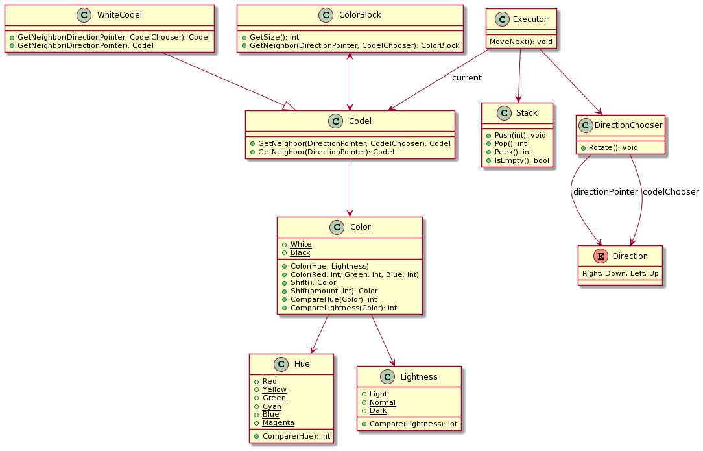

# PietSharp

[Official Piet language spec](https://www.dangermouse.net/esoteric/piet.html)

## Execution Concepts

Piet Image => Compilation => Execution

### Piet Image

An image file. Supported file types TBD.

Shall include a custom file type with a reduced size. Only need 5 bits: 1 for each color (6 hues \* 3 lightnesses + white + black + EOL = 21, 2\^5-1=31).

### Compilation

This arranges a graph of Codels for later execution.

Codels are arranged to "know" their Codel neighbors, and "know" their parent ColorBlock. Via its ColorBlock parent, a Codel can report the first Codel encountered in its ColorBlock neighbor.

ColorBlocks "know" their ColorBlock neighbors. Via its Codel children, a ColorBlock can report the first Codel encountered in its ColorBlock neighbor.

I.e., a Codel knows its Codel neighbors, but not how to find the next ColorBlock. A ColorBlock knows _how_ to find the neighboring ColorBlock, but relies on Codels to actually traverse the image (Codel graph) and find the first Codel.

The special case WhiteCodel is similar to other Codels, but has slightly different behavior as far as determining its neighbor (see official spec linked above).

### Execution

Once the Codel/ColorBlock graph is constructed in memory, execution should be as easy as comparing the "current" ColorBlock to the next.

## Architecture

[Source PlantUML](./docs/ClassDiagram.txt)
